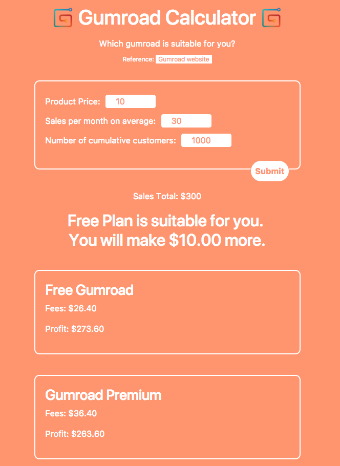

<h1 align="center"> Gumroad Plan Calculator </h1>

With <a href="http://gumroadcalculator.yingjiehu.com">Gumroad Plan Calculator</a>, you can choose Gumroad plan more wisely and earn more money 💵 💵 

	

	Created and Maintained By <a href="http://yingjiehu.com" target="_blank">Yingjie Hu</a> with ❤️ &nbsp;Follow me on <a href="https://twitter.com/yingjieYJH" target="_blank">Twitter</a>. Support me on <a href="https://www.patreon.com/yingjie">Patreon</a>

	<a href="http://gumroadcalculator.yingjiehu.com">Website</a>&nbsp;&nbsp;&nbsp;
	<a href="https://github.com/huyingjie/gumroad-plan-calculator/graphs/contributors">Contributors</a>&nbsp;&nbsp;&nbsp;
	<a href="https://www.patreon.com/yingjie" target="_blank">Donation</a>&nbsp;&nbsp;&nbsp;
	<a href="https://www.patreon.com/yingjie" target="_blank">Become a Sponsor</a>

 

## License

This work is licensed under a [Creative Commons Attribution 4.0 International License](http://creativecommons.org/licenses/by/4.0/).

[OSS Icon]: https://cdn.rawgit.com/Awesome-Windows/Awesome/master/media/OSS.svg
[Freeware Icon]: https://cdn.rawgit.com/Awesome-Windows/Awesome/master/media/free.svg

